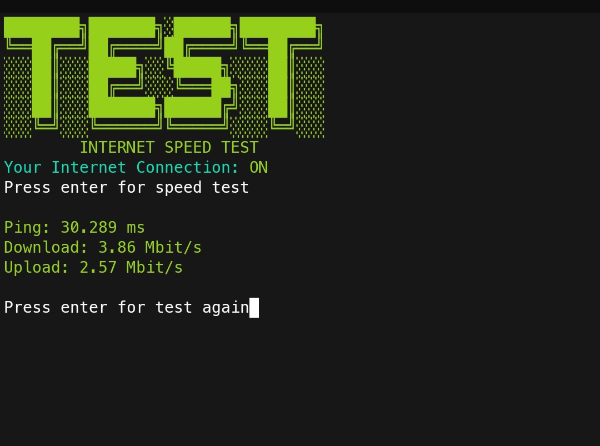
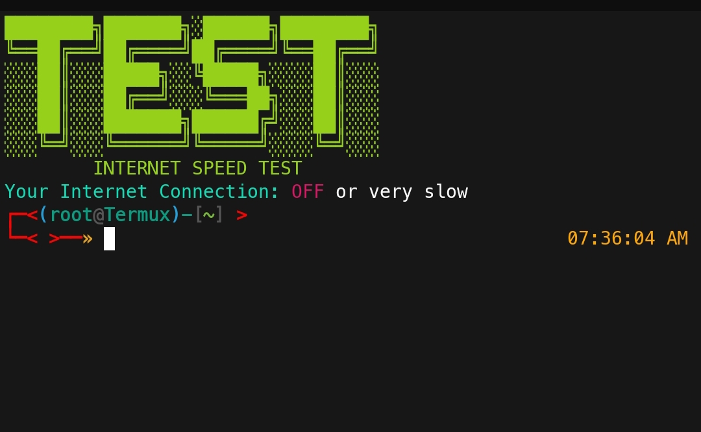

# test
Internet speed testing tool... 

# When Your Data On
</img>
# When Your Data Off
</img>

HOW TO INSTALL

<li>apt update && apt upgrade</li>
<li>git clone https://github.com/RS-YAAD/test</li>
<li>cd test </li>
<li>chmod +x test.sh </li>
<li>./test.sh </li>
 

SINGLE COMMAND

<li>git clone https://github.com/RS-YAAD/test && cd test && chmod +x test.sh && ./test.sh </li>

 

<h3>CONTACT ME</h3>
 
<a href="https://www.facebook.com/its.rs.yaad">FACEBOOK</a>  
<a href="https://m.me/its.rs.yaad">MESSENGER</a>                       
<a href="mailto: its.rs.yaad@gmail.com">GMAIL</a>  
<a href="https://github.com/RS-YAAD">GITHUB</a>

